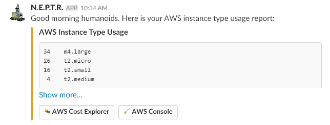
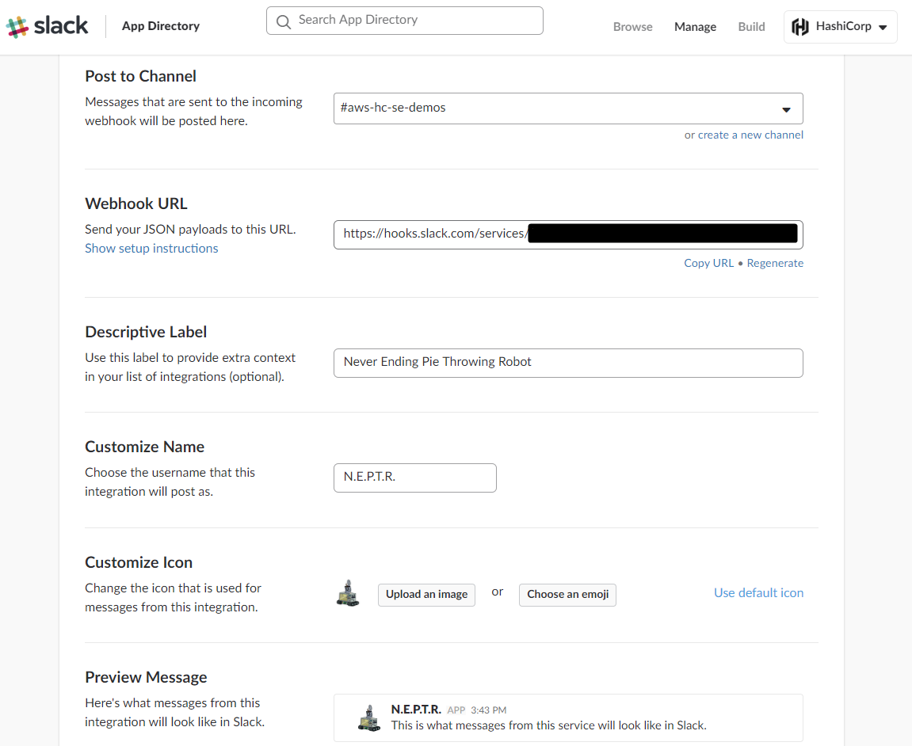
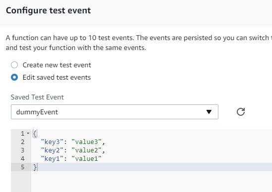

# Terraforming EC2 lifecycles with AWS Lambda & Slack
Terraform configuration for lifecycle management of AWS instances.



Are you spending too much on your AWS instances every month? Do your developers create instances and forget to turn them off? Perhaps you struggle with identifying which person or system created AWS resources? This guide is for you!

## Reference Material
 * [AWS Lambda & Slack Tutorial](https://api.slack.com/tutorials/aws-lambda)
 * [Slack Integration Blueprints for AWS Lambda](https://aws.amazon.com/blogs/aws/new-slack-integration-blueprints-for-aws-lambda/)
 * [Terraform aws_lambda_function resource](https://www.terraform.io/docs/providers/aws/r/lambda_function.html)


## Estimated Time to Complete
30-60 minutes

## Personas
Our target persona is anyone concerned with monitoring and keeping AWS instance costs under control. This may include system administrators, cloud engineers, or solutions architects. 

## Challenge
Many organizations struggle to maintain control over spending on AWS resources. Amazon Web Services makes it very easy to spin up new applicaiton workloads in the cloud, but the user is left to their own devices to clean up any unused or expired infrastructure. Users need an easy way to enforce tagging standards and shut down or terminate instances that are no longer required.

## Solution
This Terraform configuration deploys AWS Lambda functions that can do the following:

 - Check for mandatory tags on AWS instances and notify via Slack if untagged instances are found.
 - Notify on how many of each instance type are currently running across all regions.
 - Shutdown untagged instances after X days.
 - Delete untagged instances after Y days.
 - Delete machines whose TTL (time to live) has expired.

### Directory Structure
A description of what each file does:
```
 main.tf - Main configuration file. REQUIRED
 data_collectors.tf - Lambda functions for gathering instance data. REQUIRED
 iam_roles.tf - Configures IAM role and policies for your Lambda functions. REQUIRED
 notify_instance_usage.tf - sends reports about running instances.
 notify_untagged.tf - sends reports about untagged instances and their key names.
 instance_reaper.tf - Checks instance TTL tag, terminates instances that have expired.
 untagged_janitor.tf - Cleans up untagged instances after a set number of days.
 files/ - Contains all of the lambda source code, zip files, and IAM template files.
```

## Prerequisites
1. Admin level access to your AWS account via API. If admin access is not available you must have the ability to create, describe, and delete the following types of resources in AWS. Fine-grained configuration of IAM policies is beyond the scope of this guide. We will assume you have API keys and appropriate permissions that allow you to create the following resources using Terraform:

    aws\_cloudwatch\_event\_rule  
    aws\_cloudwatch\_event\_target  
    aws\_iam\_role  
    aws\_iam\_role\_policy  
    aws\_lambda\_function  
    aws\_lambda\_permission  
    aws\_kms\_alias  
    aws\_kms\_key  

2. Properly configured workstation or server for running Terraform commands. New to Terraform? Try our [Getting Started Guide](https://www.terraform.io/intro/getting-started/install.html)

3. An [incoming webhook integration](https://api.slack.com/incoming-webhooks) in your Slack account. If you want to receive notifications about instance usage and tags you'll need to be able to create a webhook or ask your administrator to help you create one.

## TL;DR
Below are all of the commands you'll need to run to get these lambda scripts deployed in your account:
```
# Be sure to configure your Slack webhook and edit your variables.tf file first!
terraform init
terraform plan
terraform apply
```

## Steps
The following walkthrough describes in detail the steps required to enable the cleanup and 'reaper' scripts that are included in this repo.

### Step 1: Configure incoming Slack webhook
Set up your Slack incoming webhook: https://my.slack.com/services/new/incoming-webhook/. Feel free to give your new bot a unique name, icon and description. Make note of the Webhook URL. This is a specially coded URL that allows remote applications to post data into your Slack channels. Do not share this link publicly or commit it to your source code repo. Choose the channel you want your bot to post messages to.



### Step 2: Configure your variables
Edit the `variables.tf` file and choose which region you want to run your Lambda functions in. These functions can be run from any region and manage instances in any other region.

```
variable "region" {
  default     = "us-west-2"
  description = "AWS Region"
}

variable "slack_hook_url" {
  default = "https://hooks.slack.com/services/REPLACE/WITH/YOUR_WEBHOOK"
  description = "Slack incoming webhook URL, get this from the slack management page."
}
```

 * Set the `slack_hook_url` variable to the URL you generated in step #1.  
 * Set any tags that you want to be considered mandatory in the `mandatory_tags` variable. This is a comma separated list, with no spaces between items.  
 * Set the `reap_days` and `sleep_days` to your liking. These represent the number of days after launch that an untagged instance will be stopped and terminated respectively.  
 * Leave the `is_active` variable set to 0 for testing. You must set this to 1 or True if you want to activate the scripts. 0 or False means reporting mode where nothing is actually stopped or terminated.
 * Save the `variables.tf` file.  

### Step 3: Run Terraform Plan

#### CLI
 * [Terraform Plan Docs](https://www.terraform.io/docs/commands/plan.html)

#### Request

```
$ terraform plan
```

#### Response
```
Refreshing Terraform state in-memory prior to plan...
The refreshed state will be used to calculate this plan, but will not be
persisted to local or remote state storage.

<Output omitted for brevity>

Plan: 25 to add, 0 to change, 0 to destroy.

------------------------------------------------------------------------

Note: You didn't specify an "-out" parameter to save this plan, so Terraform
can't guarantee that exactly these actions will be performed if
"terraform apply" is subsequently run.
```

### Step 4: Run Terraform Apply

#### CLI
 * [Terraform Apply Docs](https://www.terraform.io/docs/commands/apply.html)

#### Request

```
$ terraform apply
```

#### Response
```
data.aws_caller_identity.current: Refreshing state...
data.template_file.iam_lambda_read_instances: Refreshing state...
data.template_file.iam_lambda_stop_and_terminate_instances: Refreshing state...
data.template_file.iam_lambda_notify: Refreshing state...

An execution plan has been generated and is shown below.
Resource actions are indicated with the following symbols:
  + create

Terraform will perform the following actions:

<Output omitted for brevity>

aws_lambda_function.getRunningInstances: Creation complete after 22s (ID: getRunningInstances)
aws_lambda_function.getUntaggedInstances: Creation complete after 22s (ID: getUntaggedInstances)
aws_lambda_function.getTaggedInstances: Creation complete after 23s (ID: getTaggedInstances)

Apply complete! Resources: 25 added, 0 changed, 0 destroyed.
```

### Step 4: Test your Lambda functions
Now you can test your new lambda functions. Use the test button at the top of the page to ensure they are working correctly. For your test event you can simply create a dummy event with the default JSON payload:



Check your slack channel to see the messages posted from your bot.

### Step 5: Adjust Schedule
By default the reporting lambdas are set to run once per day. You can customize the schedule by adjusting the `aws_cloudwatch_event_rule` resources. The schedule follows a Unix cron-style format: `cron(0 8 * * ? *)`. The instance_reaper will be most effective if it is run every hour.

### Step 6: Go live
_IMPORTANT_: If you want to actually stop and terminate instances in a live environment, you must uncomment/edit the code inside of `cleanUntaggedInstances.py` and `checkInstanceTTLs.py`. We have commented out the lines that do these actions so you can test before going live.  This is for your own safety and protection. In order to activate these scripts you must *both* uncomment those lines *and* set the is_active variable to True. You can uncomment the lines directly in the AWS Lambda editor, or make the changes locally and re-deploy your lambdas.

See below for the lines that handle `stop()` and `terminate()` actions.

```
def sleep_instance(instance_id,region):
    ec2 = boto3.resource('ec2', region_name=region)
    """Stops instances that have gone beyond their TTL"""
    if str_to_bool(ISACTIVE) == True:
        # Uncomment to make this live!
        #ec2.instances.filter(InstanceIds=instance_id).stop()
        logger.info("I stopped "+instance_id+" in "+region)
    else:
        logger.info("I would have stopped "+instance_id+" in "+region)

def terminate_instance(instance_id,region):
    ec2 = boto3.resource('ec2', region_name=region)
    """Stops instances that have gone beyond their TTL"""
    if str_to_bool(ISACTIVE) == True:
        # Uncomment to make this live!
        #ec2.instances.filter(InstanceIds=instance_id).terminate()
        logger.info("I terminated "+instance_id+" in "+region)
    else:
        logger.info("I would have terminated "+instance_id+" in "+region)
```

## Next Steps 

### Optional - Enable KMS encryption
You can optionally encrypt the Slack Webhook URL so that it cannot be viewed in plaintext in the AWS console. This also allows you to commit your webhook URL to source code without worrying about it getting into the wrong hands. This also provides some extra security if you are working with a shared AWS account. Here are the additional steps you need to follow to enable encryption:

1. Uncomment the lines in `notifyUntaggedInstances.py` and `notifyInstanceUsage.py` (or other lambdas) that enable encryption. These are the lines you'll need to uncomment. Note how we are using the b64decode Python module to decrypt the encrypted Slack Webhook:
```
# from base64 import b64decode
# ENCRYPTED_HOOK_URL = os.environ['slackHookUrl']
# HOOK_URL = boto3.client('kms').decrypt(CiphertextBlob=b64decode(os.environ['slackHookUrl']))['Plaintext'].decode('utf-8')
```
2. Rename the `encryption.tf.disabled` file to `encryption.tf`. Terraform reads any file that ends with the *.tf extension.
3. Run `terraform apply` to generate a new AWS KMS key called `notify_slack`.
4. Log onto the AWS console and switch into the region where you deployed your Lambdas. Navigate to the AWS Lambda section of the dashboard.
5. Find the `notifyInstanceUsage` Lambda and click on it.
6. Scroll down to the Environment Variables section. Click the little arrow to expand the Encryption configuration options.
7. Check the box under "Enable helpers for encryption in transit". This will enable a new menu that says "KMS key to encrypt in transit". From that pull-down menu select the `notify_slack` key. This is the KMS key that Terraform created in step #3.
8. Click on the `Encrypt` button next to the webhook URL. This will encrypt your webhook URL. Now click on `Save` at the top right. If you don't save here the settings won't stick.
9. Navigate back to the AWS Lambda functions and repeat steps #1-8 for any other functions where you want to configure the encrypted URL.
10. If you want to make this configuration permanent, comment out the `aws_kms_key` and `aws_kms_alias` resources in encryption.tf. Then use the `terraform state rm` command to remove both of them from your state file. The key you created will now be persistent, and allow you to save your encrypted Slack Webhook URL in your variables file.  You can fetch the encrypted URL by running `terraform show` command.

### Optional - Edit the Slack message and formatting
If you'd like to customize the messages that get sent into your Slack channels, just edit the part of the code that calls the `send_slack_message` function. Note how you can put action buttons into your message to link your users to useful information or status pages.  The Slack API guide has examples and more info: https://api.slack.com/docs/message-formatting

```
    send_slack_message(
        msg_text, 
        title='AWS Instance Type Usage',        
        text="```\n"+report+"\n```",
        fallback='AWS Instance Type Usage',
        color='warning',
        actions = [
            {
                "type": "button",
                "text": ":money-burning: AWS Cost Explorer",
                "url": "http://amzn.to/2EBAfQu"
            },
            {
                "type": "button",
                "text": ":broom: AWS Console",
                "url": "https://console.aws.amazon.com/ec2/v2/home"
            },
        ]
    )
```

### Optional - Send email instead of Slack messages
If you don't have access to Slack or would rather send reports via email, simply comment out the lines in each function that run `send_slack_message` and uncomment the lines to `send_email` instead. For example, look at this section of code in `notifyInstanceUsage.py`.  You will need to verify your email address first in the AWS Simple Email Service control panel. You'll also need to change the SENDER and RECIPIENT variables listed at the top of the file to your email address.

```
    # Uncomment these lines to use email for notifications
    send_email(
        SENDER,
        RECIPIENT,
        AWS_REGION,
        SUBJECT,
        report,
        CHARSET)
    
    # send_slack_message(
    #     msg_text, 
    #     title=SUBJECT,        
```

### Clean up
Cleanup is simple, just run `terraform destroy` in your workspace and all resources will be cleaned up.