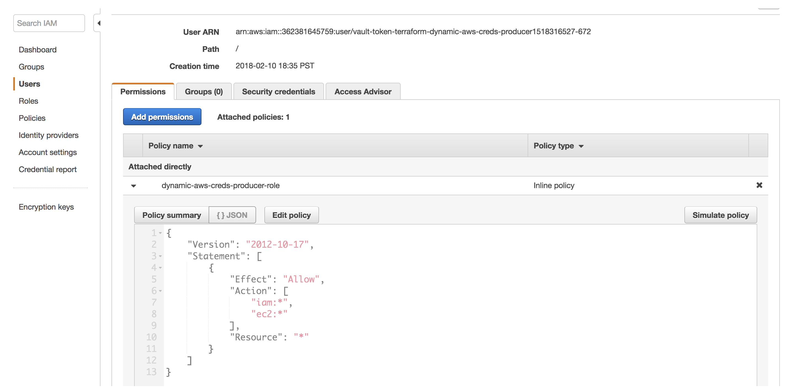
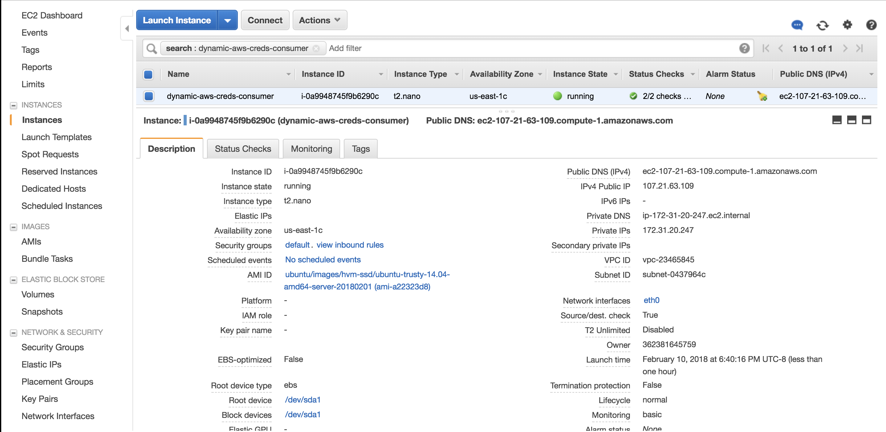
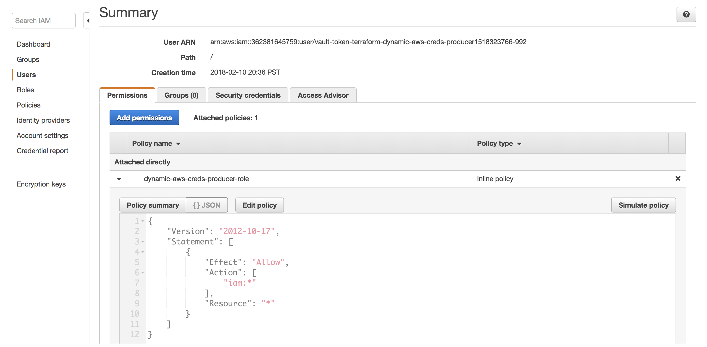

# Dynamic AWS Credentials

Using long lived static AWS credentials for Terraform runs can be dangerous. By leveraging the [Terraform Vault provider](https://www.terraform.io/docs/providers/vault/), you can generate short lived AWS credentials for each Terraform run that are automatically revoked after the run.

[](https://www.youtube.com/watch?v=0c3HUdZclTQ)

## Reference Material
- [HashiCorp's Vault](https://www.vaultproject.io/)
- [Terraform Vault provider](https://www.terraform.io/docs/providers/vault/)
- [Vault AWS Secret Engine](https://www.vaultproject.io/docs/secrets/aws/index.html)

## Estimated Time to Complete

30 minutes

## Personas

There are 2 different personas involved in this guide, the "Producer" and the "Consumer".

### Producer

The "Producer" is the operator responsible for configuring the [AWS Secrets Engine](https://www.vaultproject.io/docs/secrets/aws/index.html) in Vault and defining the policy scope for the AWS credentials dynamically generated.

The "Producer" is generally concerned about managing the static and long lived AWS IAM credentials with varying scope required for developers to provision infrastructure in AWS.

### Consumer

The "Consumer" is the developer looking to safely provision infrastructure using Terraform without having to worry about managing sensitive AWS credentials locally.

## Challenge

"Producers" want to enable a workflow where "Consumers" can automatically retrieve short-lived AWS credentials used by Terraform to provision resources in AWS. Traditionally this has been difficult to achieve as each "Consumer" has their own set of long-lived AWS credentials they use with Terraform that remain active beyond the length of a Terraform run.

Long-lived AWS credentials with unbounded scope on developer's local machines creates a large attack surface.

## Solution

Store your long-lived AWS credentials in HashiCorp's Vault's [AWS Secrets Engine](https://www.vaultproject.io/docs/secrets/aws/index.html), then leverage [Terraform's Vault provider](https://www.terraform.io/docs/providers/vault/) to dynamically generate appropriately scoped & short-lived AWS credentials to be used by Terraform to provision resources in AWS.

This mitigates the risk of someone swiping the AWS credentials used by Terraform from a developer's machine and doing something malicious with them.

Following [Terraform Recommended Practices](https://www.terraform.io/docs/enterprise/guides/recommended-practices/index.html), we will separate our Terraform templates into 2 [Workspaces](https://www.terraform.io/docs/state/workspaces.html). One Workspace for our "Producer" persona, and one Workspace for our "Consumer" persona. We do this to separate concerns and ensure each persona only has access to the resources required for them to perform their job.

The "Producer" will be responsible for configuring Vault's [AWS Secrets Engine](https://www.vaultproject.io/docs/secrets/aws/index.html) using Terraform and exposing the output variables necessary for the "Consumer" to provision the resources they need in AWS. In our use case, the "Consumer" will require access to provision an [AWS EC2 Instance](https://www.terraform.io/docs/providers/aws/r/instance.html) with Terraform, and should only be given IAM credentials with permission to do so.

## Prerequisites

1. [Download HashiCorp's Terraform](https://www.terraform.io/downloads.html)
1. [Download HashiCorp's Vault](https://www.vaultproject.io/downloads.html)

## TL;DR

Below are all of the consecutive commands that need to be run to complete this guide.

```sh
# Start Vault server
$ vault server -dev -dev-root-token-id=root

# Export env vars
export TF_VAR_aws_access_key=${AWS_ACCESS_KEY_ID} # AWS Access Key ID - This command assumes the AWS Access Key ID is set in your environment as AWS_ACCESS_KEY_ID
export TF_VAR_aws_secret_key=${AWS_SECRET_ACCESS_KEY} # AWS Secret Access Key - This command assumes the AWS Access Key ID is set in your environment as AWS_SECRET_ACCESS_KEY
export VAULT_ADDR=http://127.0.0.1:8200 # Address of Vault server
export VAULT_TOKEN=root # Vault token

# Provision "Producer" Workspace Vault resources
$ cd producer-workspace
$ terraform init
$ terraform plan
$ terraform apply -auto-approve

# Provision "Consumer" Workspace AWS resources
$ cd ../consumer-workspace
$ terraform init
$ terraform plan
$ terraform apply -auto-approve

# Destroy "Consumer" Workspace EC2 Instance
$ terraform destroy --force

# Update "Producer" AWS IAM Policy
$ cd ../producer-workspace
$ sed -i '' -e 's/, \"ec2:\*\"//g' main.tf
$ terraform plan
$ terraform apply -auto-approve

# Verify "Consumer" cannot provision EC2 Instance
$ cd ../consumer-workspace
$ terraform plan
```

## Steps

We will now walk through step by step instructions for how to dynamically generate appropriately scoped "Consumer" AWS credentials for each Terraform run.

### Step 1: Start a Vault Server

We will start by starting a Vault server. Open up a separate terminal window and run the below command.

#### CLI

- [Starting a Vault Dev Server](https://www.vaultproject.io/intro/getting-started/dev-server.html#starting-the-dev-server)

##### Request

```sh
# Start Vault server
$ vault server -dev

# export env vars
export TF_VAR_aws_access_key=${AWS_ACCESS_KEY_ID} # AWS Access Key ID - This command assumes the AWS Access Key ID is set in your environment as AWS_ACCESS_KEY_ID
export TF_VAR_aws_secret_key=${AWS_SECRET_ACCESS_KEY} # AWS Secret Access Key - This command assumes the AWS Access Key ID is set in your environment asAWS_SECRET_ACCESS_KEY
export VAULT_ADDR=http://127.0.0.1:8200 # Address of the Vault server (e.g. `http://127.0.0.1:8200` if running locally)
export VAULT_TOKEN=root # Vault token the Vault provider will use to mount and configure the [Vault AWS secret backend](https://www.terraform.io/docs/providers/vault/r/aws_secret_backend.html) and [Vault AWS secret backend role](https://www.terraform.io/docs/providers/vault/r/aws_secret_backend.html) - In this case we grabbed the `Root Token` token output from the above Vault dev server logs

# Provision "Producer" Workspace
$ cd producer-workspace
$ terraform init
$ terraform plan
$ terraform apply -auto-approve

# Provision "Consumer" Workspace
$ cd ../consumer-workspace
$ terraform init
$ terraform plan
$ terraform apply -auto-approve
$ terraform destroy --force

# Update "Producer" Workspace IAM Policy
$ cd ../producer-workspace
$ terraform plan


```

##### Response

```
==> Vault server configuration:

                     Cgo: disabled
         Cluster Address: https://127.0.0.1:8201
              Listener 1: tcp (addr: "127.0.0.1:8200", cluster address: "127.0.0.1:8201", tls: "disabled")
               Log Level: info
                   Mlock: supported: false, enabled: false
        Redirect Address: http://127.0.0.1:8200
                 Storage: inmem
                 Version: Vault v0.9.3
             Version Sha: 5acd6a21d5a69ab49d0f7c0bf540123a9b2c696d

WARNING! dev mode is enabled! In this mode, Vault runs entirely in-memory
and starts unsealed with a single unseal key. The root token is already
authenticated to the CLI, so you can immediately begin using Vault.

You may need to set the following environment variable:

    $ export VAULT_ADDR='http://127.0.0.1:8200'

The unseal key and root token are displayed below in case you want to
seal/unseal the Vault or re-authenticate.

Unseal Key: vfFcgKeoHUoIDNUNqQsrzl6Y0kASr9AZ1QCnsd6tF2k=
Root Token: root

Development mode should NOT be used in production installations!

==> Vault server started! Log data will stream in below:

2018/02/09 18:16:46.245058 [INFO ] core: security barrier not initialized
2018/02/09 18:16:46.246399 [INFO ] core: security barrier initialized: shares=1 threshold=1
2018/02/09 18:16:46.247021 [INFO ] core: post-unseal setup starting
2018/02/09 18:16:46.258342 [INFO ] core: loaded wrapping token key
2018/02/09 18:16:46.258351 [INFO ] core: successfully setup plugin catalog: plugin-directory=
2018/02/09 18:16:46.259352 [INFO ] core: successfully mounted backend: type=kv path=secret/
2018/02/09 18:16:46.259382 [INFO ] core: successfully mounted backend: type=cubbyhole path=cubbyhole/
2018/02/09 18:16:46.259705 [INFO ] core: successfully mounted backend: type=system path=sys/
2018/02/09 18:16:46.259866 [INFO ] core: successfully mounted backend: type=identity path=identity/
2018/02/09 18:16:46.261878 [INFO ] expiration: restoring leases
2018/02/09 18:16:46.261885 [INFO ] rollback: starting rollback manager
2018/02/09 18:16:46.262925 [INFO ] expiration: lease restore complete
2018/02/09 18:16:46.263967 [INFO ] identity: entities restored
2018/02/09 18:16:46.263982 [INFO ] identity: groups restored
2018/02/09 18:16:46.264010 [INFO ] core: post-unseal setup complete
2018/02/09 18:16:46.264555 [INFO ] core: root token generated
2018/02/09 18:16:46.264559 [INFO ] core: pre-seal teardown starting
2018/02/09 18:16:46.264564 [INFO ] core: cluster listeners not running
2018/02/09 18:16:46.264578 [INFO ] rollback: stopping rollback manager
2018/02/09 18:16:46.264616 [INFO ] core: pre-seal teardown complete
2018/02/09 18:16:46.264697 [INFO ] core: vault is unsealed
2018/02/09 18:16:46.264708 [INFO ] core: post-unseal setup starting
2018/02/09 18:16:46.264748 [INFO ] core: loaded wrapping token key
2018/02/09 18:16:46.264750 [INFO ] core: successfully setup plugin catalog: plugin-directory=
2018/02/09 18:16:46.264873 [INFO ] core: successfully mounted backend: type=kv path=secret/
2018/02/09 18:16:46.264944 [INFO ] core: successfully mounted backend: type=system path=sys/
2018/02/09 18:16:46.265047 [INFO ] core: successfully mounted backend: type=identity path=identity/
2018/02/09 18:16:46.265053 [INFO ] core: successfully mounted backend: type=cubbyhole path=cubbyhole/
2018/02/09 18:16:46.265427 [INFO ] expiration: restoring leases
2018/02/09 18:16:46.265433 [INFO ] rollback: starting rollback manager
2018/02/09 18:16:46.265518 [INFO ] expiration: lease restore complete
2018/02/09 18:16:46.265522 [INFO ] identity: entities restored
2018/02/09 18:16:46.265541 [INFO ] identity: groups restored
2018/02/09 18:16:46.265549 [INFO ] core: post-unseal setup complete
```

### Step 2: Configure Environment Variables

Terraform requires a few [Environment Variables](https://www.terraform.io/docs/configuration/variables.html#environment-variables) to be set in order to function appropriately. We're passing these in as env vars instead of [Terraform Input Variables](https://www.terraform.io/docs/configuration/variables.html) because they are sensitive and we don't want them committed to our VCS.

Notice that we're also setting the required [Vault Provider Arguments](https://www.terraform.io/docs/providers/vault/index.html#provider-arguments) as env vars: `VAULT_ADDR` & `VAULT_TOKEN`.

#### CLI

##### Request

```sh
export TF_VAR_aws_access_key=${AWS_ACCESS_KEY_ID} # AWS Access Key ID - This command assumes the AWS Access Key ID is set in your environment as AWS_ACCESS_KEY_ID
export TF_VAR_aws_secret_key=${AWS_SECRET_ACCESS_KEY} # AWS Secret Access Key - This command assumes the AWS Access Key ID is set in your environment as AWS_SECRET_ACCESS_KEY
export VAULT_ADDR=http://127.0.0.1:8200 # Address of the Vault server (e.g. `http://127.0.0.1:8200` if running locally)
export VAULT_TOKEN=root # Vault token the Vault provider will use to mount and configure the [Vault AWS secret backend](https://www.terraform.io/docs/providers/vault/r/aws_secret_backend.html) and [Vault AWS secret backend role](https://www.terraform.io/docs/providers/vault/r/aws_secret_backend.html) - In this case we grabbed the `Root Token` token output from the above Vault dev server logs
```

##### Response

You can verify that these env vars were set appropriately by using `echo`.

```sh
$ echo ${TF_VAR_aws_access_key}
ABCDEFGHIJKLMNOPQRST

$ echo ${TF_VAR_aws_secret_key}
abcdefghijklmnopqrstuvwxyz12345678910987

$ echo ${VAULT_ADDR}
http://127.0.0.1:8200

$ echo ${VAULT_TOKEN}
root
```

### Step 3: "Producer" Workspace Init

We will start by initializing the "Producer" Workspace. This will initialize Terraform and pull down the appropriate [Terraform providers](https://www.terraform.io/docs/providers/index.html) required by the declared resources.

Be sure you are starting in the root directory of this repository. After running the command, notice Terraform fetches the [Vault](https://www.terraform.io/docs/providers/vault/index.html) provider.

Take a look at the [producer-workspace/main.tf](producer-workspace/main.tf) Terraform template to see the Vault resources Terraform will configure.

#### CLI

- [terraform init](https://www.terraform.io/docs/commands/init.html)

##### Request

```sh
$ cd producer-workspace
$ terraform init
```

##### Response

```
Initializing the backend...

Successfully configured the backend "local"! Terraform will automatically
use this backend unless the backend configuration changes.

Initializing provider plugins...
- Checking for available provider plugins on https://releases.hashicorp.com...
- Downloading plugin for provider "vault" (1.0.0)...

The following providers do not have any version constraints in configuration,
so the latest version was installed.

To prevent automatic upgrades to new major versions that may contain breaking
changes, it is recommended to add version = "..." constraints to the
corresponding provider blocks in configuration, with the constraint strings
suggested below.

* provider.vault: version = "~> 1.0"

Terraform has been successfully initialized!

You may now begin working with Terraform. Try running "terraform plan" to see
any changes that are required for your infrastructure. All Terraform commands
should now work.

If you ever set or change modules or backend configuration for Terraform,
rerun this command to reinitialize your working directory. If you forget, other
commands will detect it and remind you to do so if necessary.
```

### Step 4: "Producer" Workspace Plan

Run a `terraform plan` to inspect what Terraform is going to provision in the "Producer" Workspace.

Notice that Terraform's plan is to mount the [AWS Secrets Engine](https://www.vaultproject.io/docs/secrets/aws/index.html) with a [`default_lease_ttl_seconds`](https://www.terraform.io/docs/providers/vault/r/aws_secret_backend.html#default_lease_ttl_seconds) of `120` seconds, a [`max_lease_ttl_seconds`](https://www.terraform.io/docs/providers/vault/r/aws_secret_backend.html#max_lease_ttl_seconds) of `240` seconds, and a policy that allows the AWS IAM credentials `iam:*` and `ec2:*` permissions. Any credentials read from this role will be dynamically generated with these attributes.

#### CLI

- [terraform plan](https://www.terraform.io/docs/commands/plan.html)

##### Request

```sh
$ terraform plan
```

##### Response

```
Refreshing Terraform state in-memory prior to plan...
The refreshed state will be used to calculate this plan, but will not be
persisted to local or remote state storage.


------------------------------------------------------------------------

An execution plan has been generated and is shown below.
Resource actions are indicated with the following symbols:
  + create

Terraform will perform the following actions:

  + vault_aws_secret_backend.aws
      id:                        <computed>
      access_key:                <sensitive>
      default_lease_ttl_seconds: "120"
      max_lease_ttl_seconds:     "240"
      path:                      "dynamic-aws-creds-producer-path"
      region:                    <computed>
      secret_key:                <sensitive>

  + vault_aws_secret_backend_role.producer
      id:                        <computed>
      backend:                   "dynamic-aws-creds-producer-path"
      name:                      "dynamic-aws-creds-producer-role"
      policy:                    "{\n  \"Version\": \"2012-10-17\",\n  \"Statement\": [\n    {\n      \"Effect\": \"Allow\",\n      \"Action\": [\n        \"iam:*\",\n        \"ec2:*\"\n      ],\n      \"Resource\": \"*\"\n    }\n  ]\n}\n"


Plan: 2 to add, 0 to change, 0 to destroy.

------------------------------------------------------------------------

Note: You didn't specify an "-out" parameter to save this plan, so Terraform
can't guarantee that exactly these actions will be performed if
"terraform apply" is subsequently run.
```

### Step 5: "Producer" Workspace Apply

Run the `terraform apply` to actually provision the resources in the "Producer" Workspace. Based on the plan, we expect Terraform to...

1. Use the AWS credentials supplied by the env vars in [Step 2](#step-2-configure-environment-variables) to mount the AWS Secret Engine in Vault under the path `dynamic-aws-creds-producer-path`.
2. Configure a role for the [AWS Secrets Engine](https://www.vaultproject.io/docs/secrets/aws/index.html) named `dynamic-aws-creds-producer-role` with an IAM policy that allows it `iam:*` and `ec2:*` permissions.
  - This role will be used by the "Consumer" Workspace to dynamically generate AWS credentials scoped with this IAM policy to be used by Terraform to provision an [`aws_instance`](https://www.terraform.io/docs/providers/aws/r/instance.html) resource.

#### CLI

- [terraform apply](https://www.terraform.io/docs/commands/apply.html)

##### Request

```sh
$ terraform apply -auto-approve
```

Notice we added the `-auto-approve` switch. This tells Terraform to just run the apply without prompting us to verify we actually wanted to apply.

##### Response

```
vault_aws_secret_backend.aws: Creating...
  access_key:                "<sensitive>" => "<sensitive>"
  default_lease_ttl_seconds: "" => "120"
  max_lease_ttl_seconds:     "" => "240"
  path:                      "" => "dynamic-aws-creds-producer-path"
  region:                    "" => "<computed>"
  secret_key:                "<sensitive>" => "<sensitive>"
vault_aws_secret_backend.aws: Creation complete after 0s (ID: dynamic-aws-creds-producer-path)
vault_aws_secret_backend_role.producer: Creating...
  backend: "" => "dynamic-aws-creds-producer-path"
  name:    "" => "dynamic-aws-creds-producer-role"
  policy:  "" => "{\n  \"Version\": \"2012-10-17\",\n  \"Statement\": [\n    {\n      \"Effect\": \"Allow\",\n      \"Action\": [\n        \"iam:*\",\n        \"ec2:*\"\n      ],\n      \"Resource\": \"*\"\n    }\n  ]\n}\n"
vault_aws_secret_backend_role.producer: Creation complete after 0s (ID: dynamic-aws-creds-producer-path/roles/dynamic-aws-creds-producer-role)

Apply complete! Resources: 2 added, 0 changed, 0 destroyed.

The state of your infrastructure has been saved to the path
below. This state is required to modify and destroy your
infrastructure, so keep it safe. To inspect the complete state
use the `terraform show` command.

State path: terraform.tfstate

Outputs:

backend = dynamic-aws-creds-producer-path
role = dynamic-aws-creds-producer-role
```

Notice there are 2 [Output Variables](https://www.terraform.io/intro/getting-started/outputs.html) named `backend` & `role`. These output variables will be used by the "Consumer" workspace in a later step.

If you go to the terminal where your Vault server is running, you should see Vault output something similar to the below. This means Terraform was successfully able to mount the AWS Secrets Engine at the specified path. Although it's not output in the logs, the role has also been configured.

```
2018/02/10 19:23:37.072445 [INFO ] core: successful mount: path=dynamic-aws-creds-producer-path/ type=aws
```

### Step 6: "Consumer" Workspace Init

Next we will initialize the "Consumer" Workspace, similar to what we did with the "Producer" Workspace. This Workspace will consume the outputs created in the "Producer" Workspace.

Take a look at the [consumer-workspace/main.tf](consumer-workspace/main.tf) Terraform template to see the resources Terraform will provision.

#### CLI

- [terraform init](https://www.terraform.io/docs/commands/init.html)

##### Request

```sh
$ cd ../consumer-workspace
$ terraform init
```

##### Response

```
Initializing the backend...

Successfully configured the backend "local"! Terraform will automatically
use this backend unless the backend configuration changes.

Initializing provider plugins...
- Checking for available provider plugins on https://releases.hashicorp.com...
- Downloading plugin for provider "aws" (1.9.0)...
- Downloading plugin for provider "vault" (1.0.0)...

The following providers do not have any version constraints in configuration,
so the latest version was installed.

To prevent automatic upgrades to new major versions that may contain breaking
changes, it is recommended to add version = "..." constraints to the
corresponding provider blocks in configuration, with the constraint strings
suggested below.

* provider.aws: version = "~> 1.9"
* provider.vault: version = "~> 1.0"

Terraform has been successfully initialized!

You may now begin working with Terraform. Try running "terraform plan" to see
any changes that are required for your infrastructure. All Terraform commands
should now work.

If you ever set or change modules or backend configuration for Terraform,
rerun this command to reinitialize your working directory. If you forget, other
commands will detect it and remind you to do so if necessary.
```

### Step 7: "Consumer" Workspace Plan to Provision EC2 Instance

First, login to your [AWS Console](https://console.aws.amazon.com) and navigate to the IAM `Users` tab. Search for the username prefix `vault-token-terraform-dynamic-aws-creds-producer`. Nothing will show up in your initial search, but we are now prepared to do a "Refresh" after we run a `terraform plan` to verify that the dynamic IAM credentials were in fact created by Vault and used by Terraform.

In the [consumer-workspace/main.tf#L46-L55](consumer-workspace/main.tf#L46-L55) Terraform template we've defined an [`aws_instance`](https://www.terraform.io/docs/providers/aws/r/instance.html) to be provisioned. Assuming the credentials passed into the AWS provider have access to create the EC2 Instance resource, the plan should run successfully.

Now run a `terraform plan` to inspect what Terraform is going to provision in the "Consumer" Workspace and verify a new set of IAM credentials were created after running the plan.

The reason the IAM credentials were created is we have a [`vault_aws_access_credentials` Data Source](https://www.terraform.io/docs/providers/vault/d/aws_access_credentials.html) in our [consumer-workspace/main.tf#L19-L27](consumer-workspace/main.tf#L19-L27) Terraform template that is requesting the Vault provider to [read AWS IAM credentials](https://www.vaultproject.io/docs/secrets/aws/index.html#usage) from the role named `dynamic-aws-creds-producer-role` in Vault's [AWS Secrets Engine](https://www.vaultproject.io/docs/secrets/aws/index.html).

These credentials are generated by Vault with the appropriate [IAM policy](https://www.terraform.io/docs/providers/vault/r/aws_secret_backend_role.html#policy) configured in the [`vault_aws_secret_backend_role` role](https://www.terraform.io/docs/providers/vault/r/aws_secret_backend_role.html) resource, and a [`default_lease`](https://www.terraform.io/docs/providers/vault/r/aws_secret_backend.html#default_lease_ttl_seconds) and [`max_lease_ttl`](https://www.terraform.io/docs/providers/vault/r/aws_secret_backend.html#max_lease_ttl_seconds) configured on the [AWS Secret Engine](https://www.terraform.io/docs/providers/vault/r/aws_secret_backend.html). These resources were configured by the "Producer" in the [producer-workspace/main.tf#L13-L40](producer-workspace/main.tf#L13-L40) Terraform template.

Because the `default_lease_ttl_seconds ` is set to `120` seconds, Vault will revoke those IAM credentials and they will be removed from the AWS IAM console after `120` seconds. Every Terraform run moving forward will now use it's own unique set of AWS IAM credentials that are scoped to whatever the "Producer" has defined!

#### CLI

- [terraform plan](https://www.terraform.io/docs/commands/plan.html)

##### Request

```sh
$ terraform plan
```

##### Response

```
Refreshing Terraform state in-memory prior to plan...
The refreshed state will be used to calculate this plan, but will not be
persisted to local or remote state storage.

data.terraform_remote_state.producer: Refreshing state...
data.vault_aws_access_credentials.creds: Refreshing state...
data.aws_ami.ubuntu: Refreshing state...

------------------------------------------------------------------------

An execution plan has been generated and is shown below.
Resource actions are indicated with the following symbols:
  + create

Terraform will perform the following actions:

  + aws_instance.main
      id:                           <computed>
      ami:                          "ami-a22323d8"
      associate_public_ip_address:  <computed>
      availability_zone:            <computed>
      ebs_block_device.#:           <computed>
      ephemeral_block_device.#:     <computed>
      instance_state:               <computed>
      instance_type:                "t2.nano"
      ipv6_address_count:           <computed>
      ipv6_addresses.#:             <computed>
      key_name:                     <computed>
      network_interface.#:          <computed>
      network_interface_id:         <computed>
      placement_group:              <computed>
      primary_network_interface_id: <computed>
      private_dns:                  <computed>
      private_ip:                   <computed>
      public_dns:                   <computed>
      public_ip:                    <computed>
      root_block_device.#:          <computed>
      security_groups.#:            <computed>
      source_dest_check:            "true"
      subnet_id:                    <computed>
      tags.%:                       "3"
      tags.Name:                    "dynamic-aws-creds-consumer"
      tags.TTL:                     "1h"
      tags.owner:                   "dynamic-aws-creds-consumer-guide"
      tenancy:                      <computed>
      volume_tags.%:                <computed>
      vpc_security_group_ids.#:     <computed>


Plan: 1 to add, 0 to change, 0 to destroy.

------------------------------------------------------------------------

Note: You didn't specify an "-out" parameter to save this plan, so Terraform
can't guarantee that exactly these actions will be performed if
"terraform apply" is subsequently run.
```




### Step 8: "Consumer" Workspace Apply to Provision EC2 Instance

Now that we've run a successful plan, the "Consumer" will actually want to provision the EC2 Instance in AWS. We should expect to see yet another set of IAM credentials named with a prefix of `vault-token-terraform-dynamic-aws-creds-producer` and an appropriately scoped IAM policy attached.

These IAM creds will be dynamically generated by Vault and used for the AWS provider in Terraform to provision the [`aws_instance`](https://www.terraform.io/docs/providers/aws/r/instance.html) resource. You will be able to see this in the AWS EC2 dashboard by searching for `Instances` with the name `dynamic-aws-creds-consumer`.

Just like the `terraform plan`, the short lived IAM credentials used by Terraform will be revoked after `120` seconds.

#### CLI

- [terraform apply](https://www.terraform.io/docs/commands/apply.html)

##### Request

```sh
$ terraform apply -auto-approve
```

Notice we added the `-auto-approve` switch. This tells Terraform to just run the apply with out prompting us to verify we actually wanted to apply.

##### Response

```
data.terraform_remote_state.producer: Refreshing state...
data.vault_aws_access_credentials.creds: Refreshing state...
data.aws_ami.ubuntu: Refreshing state...
aws_instance.main: Creating...
  ami:                          "" => "ami-a22323d8"
  associate_public_ip_address:  "" => "<computed>"
  availability_zone:            "" => "<computed>"
  ebs_block_device.#:           "" => "<computed>"
  ephemeral_block_device.#:     "" => "<computed>"
  instance_state:               "" => "<computed>"
  instance_type:                "" => "t2.nano"
  ipv6_address_count:           "" => "<computed>"
  ipv6_addresses.#:             "" => "<computed>"
  key_name:                     "" => "<computed>"
  network_interface.#:          "" => "<computed>"
  network_interface_id:         "" => "<computed>"
  placement_group:              "" => "<computed>"
  primary_network_interface_id: "" => "<computed>"
  private_dns:                  "" => "<computed>"
  private_ip:                   "" => "<computed>"
  public_dns:                   "" => "<computed>"
  public_ip:                    "" => "<computed>"
  root_block_device.#:          "" => "<computed>"
  security_groups.#:            "" => "<computed>"
  source_dest_check:            "" => "true"
  subnet_id:                    "" => "<computed>"
  tags.%:                       "" => "3"
  tags.Name:                    "" => "dynamic-aws-creds-consumer"
  tags.TTL:                     "" => "1h"
  tags.owner:                   "" => "dynamic-aws-creds-consumer-guide"
  tenancy:                      "" => "<computed>"
  volume_tags.%:                "" => "<computed>"
  vpc_security_group_ids.#:     "" => "<computed>"
aws_instance.main: Still creating... (10s elapsed)
aws_instance.main: Still creating... (20s elapsed)
aws_instance.main: Creation complete after 25s (ID: i-0c47c6d46f0a71fb8)

Apply complete! Resources: 1 added, 0 changed, 0 destroyed.

The state of your infrastructure has been saved to the path
below. This state is required to modify and destroy your
infrastructure, so keep it safe. To inspect the complete state
use the `terraform show` command.

State path: terraform.tfstate
```

Voila, our "Consumer" has successfully created the EC2 Instance resource without ever having long-lived AWS credentials locally.



### Step 9: "Consumer" to Destroy EC2 Instance

Now let's cleanup the EC2 Instance created by Terraform. After destroying, you can check in the AWS Console to verify they were deleted. You should also have seen another set of IAM credentials get _generated_ to run the `terraform destroy` operation.

#### CLI

- [terraform destroy](https://www.terraform.io/docs/commands/destroy.html)

##### Request

```sh
$ terraform destroy --force
```

Notice we're using the `--force` switch to prevent Terraform from prompting us to verify it's what we want to do.

##### Response

```
data.terraform_remote_state.producer: Refreshing state...
data.vault_aws_access_credentials.creds: Refreshing state...
data.aws_ami.ubuntu: Refreshing state...
aws_instance.main: Refreshing state... (ID: i-0c47c6d46f0a71fb8)
aws_instance.main: Destroying... (ID: i-0c47c6d46f0a71fb8)
aws_instance.main: Still destroying... (ID: i-0c47c6d46f0a71fb8, 10s elapsed)
aws_instance.main: Still destroying... (ID: i-0c47c6d46f0a71fb8, 20s elapsed)
aws_instance.main: Destruction complete after 21s

Destroy complete! Resources: 1 destroyed.
```

### Step 10: "Producer" IAM Policy Update Plan

Now let's say the "Producer" wanted to scope the "Consumers" IAM policy to only allow them to create `iam` resources with Terraform, but not `ec2`.

Previously, this would have required them to revoke every "Consumers" IAM credentials and generate new ones with the updated policy. However, because we are dynamically generating IAM credentials for each Terraform run, the "Producer" simply has to update the IAM policy in their [producer-workspace/main.tf#L27-L38](producer-workspace/main.tf#L27-L38) Terraform template and they're done.

To prove this, we will change the IAM policy in the [producer-workspace/main.tf](producer-workspace/main.tf#L27-L39) Terraform template from...

```
{
  "Version": "2012-10-17",
  "Statement": [
    {
      "Effect": "Allow",
      "Action": [
        "iam:*", "ec2:*"
      ],
      "Resource": "*"
    }
  ]
}
```

to...

```
{
  "Version": "2012-10-17",
  "Statement": [
    {
      "Effect": "Allow",
      "Action": [
        "iam:*"
      ],
      "Resource": "*"
    }
  ]
}
```

This means that any "Consumer" should now not be allowed to provision any AWS EC2 resources.

#### CLI

- [terraform plan](https://www.terraform.io/docs/commands/plan.html)

##### Request

```sh
$ cd ../producer-workspace
$ sed -i '' -e 's/, \"ec2:\*\"//g' main.tf
$ terraform plan
```

##### Response

```
Refreshing Terraform state in-memory prior to plan...
The refreshed state will be used to calculate this plan, but will not be
persisted to local or remote state storage.

vault_aws_secret_backend.aws: Refreshing state... (ID: dynamic-aws-creds-producer-path)
vault_aws_secret_backend_role.producer: Refreshing state... (ID: dynamic-aws-creds-producer-path/roles/dynamic-aws-creds-producer-role)

------------------------------------------------------------------------

An execution plan has been generated and is shown below.
Resource actions are indicated with the following symbols:
  ~ update in-place

Terraform will perform the following actions:

  ~ vault_aws_secret_backend_role.producer
      policy: "{\"Version\":\"2012-10-17\",\"Statement\":[{\"Effect\":\"Allow\",\"Action\":[\"iam:*\",\"ec2:*\"],\"Resource\":\"*\"}]}" => "{\n  \"Version\": \"2012-10-17\",\n  \"Statement\": [\n    {\n      \"Effect\": \"Allow\",\n      \"Action\": [\n        \"iam:*\"\n      ],\n      \"Resource\": \"*\"\n    }\n  ]\n}\n"


Plan: 0 to add, 1 to change, 0 to destroy.

------------------------------------------------------------------------

Note: You didn't specify an "-out" parameter to save this plan, so Terraform
can't guarantee that exactly these actions will be performed if
"terraform apply" is subsequently run.
```

### Step 11: "Producer" Policy Update Apply

We will now apply those changes and update Vault role's policy.

#### CLI

- [terraform apply](https://www.terraform.io/docs/commands/apply.html)

##### Request

```sh
$ terraform apply -auto-approve
```

##### Response

```
vault_aws_secret_backend.aws: Refreshing state... (ID: dynamic-aws-creds-producer-path)
vault_aws_secret_backend_role.producer: Refreshing state... (ID: dynamic-aws-creds-producer-path/roles/dynamic-aws-creds-producer-role)
vault_aws_secret_backend_role.producer: Modifying... (ID: dynamic-aws-creds-producer-path/roles/dynamic-aws-creds-producer-role)
  policy: "{\"Version\":\"2012-10-17\",\"Statement\":[{\"Effect\":\"Allow\",\"Action\":[\"iam:*\",\"ec2:*\"],\"Resource\":\"*\"}]}" => "{\n  \"Version\": \"2012-10-17\",\n  \"Statement\": [\n    {\n      \"Effect\": \"Allow\",\n      \"Action\": [\n        \"iam:*\"\n      ],\n      \"Resource\": \"*\"\n    }\n  ]\n}\n"
vault_aws_secret_backend_role.producer: Modifications complete after 0s (ID: dynamic-aws-creds-producer-path/roles/dynamic-aws-creds-producer-role)

Apply complete! Resources: 0 added, 1 changed, 0 destroyed.

The state of your infrastructure has been saved to the path
below. This state is required to modify and destroy your
infrastructure, so keep it safe. To inspect the complete state
use the `terraform show` command.

State path: terraform.tfstate

Outputs:

backend = dynamic-aws-creds-producer-path
role = dynamic-aws-creds-producer-role
```

### Step 12: "Consumer" Workspace Plan to Provision EC2 Instance

Now we will verify the "Consumer" is _not_ able to provision an EC2 Instance as it should no longer have the ability to do so based on the updates the "Producer" made to the IAM policy. We should expect to see the `terraform plan` fail here as the credentials generated don't have permission to provision the [`aws_instance`](https://www.terraform.io/docs/providers/aws/r/instance.html) resource.

Let's try it.

#### CLI

- [terraform plan](https://www.terraform.io/docs/commands/plan.html)

##### Request

```sh
$ cd ../consumer-workspace
$ terraform plan
```

##### Response

```
Refreshing Terraform state in-memory prior to plan...
The refreshed state will be used to calculate this plan, but will not be
persisted to local or remote state storage.

data.terraform_remote_state.producer: Refreshing state...
data.vault_aws_access_credentials.creds: Refreshing state...
data.aws_ami.ubuntu: Refreshing state...

Error: Error refreshing state: 1 error(s) occurred:

* data.aws_ami.ubuntu: 1 error(s) occurred:

* data.aws_ami.ubuntu: data.aws_ami.ubuntu: UnauthorizedOperation: You are not authorized to perform this operation.
	status code: 403, request id: 5f25a398-9417-4e16-9bae-f336d624e017
```

As expected, our plan failed! The "Producer" would need to add the `ec2:*` permission back to the IAM policy for this plan to succeed.



## Next Steps

Play around with the "Producer" permissions and the "Consumer" resources to get a feel for how this can work for you.

Once finished, run `terraform destroy` in each "Producer" and "Consumer" workspace to ensure all resources are cleaned up.

You can take your security to the next level by leveraging Terraform Enterprise's [Secure Storage of Variables](https://www.terraform.io/docs/enterprise/workspaces/variables.html#secure-storage-of-variables) to safely store sensitive variables like the Vault token used for authentication.
